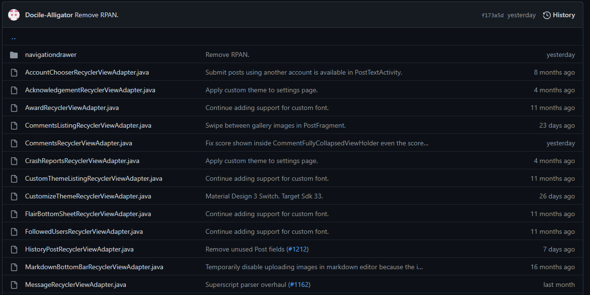

# Infinity for Reddit Codebase Analysis

## Source Code Organization

An important part of large software projects is how source code is created and organized throughout the project. A complex application such as *Infinity for Reddit* can easily have hundreds, if not thousands, of individual source code files. If these files are poorly organized it can quickly impair a developers ability to navigate a project. This becomes increasingly critical in open source projects, where many developers will be working on different components with little communication between each other. Active open source projects also usually have many new contributors coming to the project who need to familiarize themself with the codebase. If not diligently enforced, code organization can spiral out of control and make it difficult for new and existing developers to interact with the codebase.

*Infinity for Reddit* makes an attempt at organizing its code. All Java source files for the application are found in the package `ml.docilealligator.infinityforreddit`. In this base package, there are about 51 different files each pertaining to a different purpose. Files such as `Infinity.java` are high level instances which manage the initialization and general operation of the application. Other classes found in this package such as `ReportThing.java` pertain to very specific functions of the app. Additionally, this base package contains another 30 subpackages. These subpackages contain 2 - 30 child files, and usually pertain to a certain function or pattern type. Subpackages, even the larger ones, rarely have any further internal organization. One package may serve a number of different functions.

Figure 1 - Loosely organized source files in the root directory

As alluded to in the previous paragraph, there are a number of issues with the way that *Infinity for Reddit* is organized. The first major issue is due to the amount and variety of classes found in the root package. There are 51 java source files found here. Between the different files, there are few consistent rules moderating what sort of classes are stored there. To remedy this cluttered organizational situation, better naming and sorting conventions can be used [[1](#references)]. These include:

- Keeping high level functional classes in the root package. These will serve to "link" the subpackages together. These are also the first packages that a new developer will encounter when reading the source code, and therefore should give an understanding on how the app as a whole works. Examples of these classes are `Infinity.java`, `AppComponent.java`, and `AppModule.java`.

- Source files that refer to specific independent functions should be placed in their respective subpackage. This will allow developers to easily find them when the need arises. For example, the file `CustomFontReceiver.java` should be moved to the `font` package, as it serves the function of handling fonts. Other classes that could be sorted include `ImgurMedia.java`, `PollPayload.java`, `UserFlair`, and most other classes found in the root package.

Adjusting the naming convention of Java packages could also serve to improve the organizational strategy of *Infinity for Reddit*. Naming convention of this form is less of a defined science and more opinion based, but there still are commonly accepted strategies [[2](#references)]. By using a naming scheme which organizes files by functional group, instead of data structure or access pattern, the name of the package intuitively conveys its contents. This naming convention is utilized in the packages `award`, `message`, and `multireddit`. Names such as `activities`, `adapters`, and `services` are more confusing because they refer to what pattern the classes are, instead of what they do. Source files found in these packages refer to many different, unique functions. When a developer is attempting to work on a subsystem, they will have to check these packages in addition to the subsystem package to fully understand its function. To improve organization, packages of the latter type should be broken up, and source files should be moved to their respective functional package.

Figure 2 - Sources files in the 'adapters' package referring to various unrelated subsystems

## Static Code Analysis

Static code analysis is the process of inspecting source code to find possible defects. Many clean code bases enforce a strict static code analysis process. By statically analyzing source code, the introduction of poor practices such as security flaws, formatting issues, and code smells can be avoided. Ideally, issues such as these are identified and fixed before merging into master. Unfortunately, Infinity for Reddit does not strictly adhere to these practices, leading to an untidy codebase.

 
Figure 3: Android Studio inspection report. This static code analysis discovered 13 errors, 5,715 warnings, and 2,373 potential typos.

A common method to inspect an Android project is to run a code analysis using Android Studio. Figure 3, above, shows the results of this analysis on Infinity for Reddit. A significant number of errors and warnings were discovered, indicating room for improvement within the codebase.

> Note: to run your own static code analysis of the repository in Android Studio, click 'Code', 'Inspect Code', 'Whole Project', and 'OK'.

The inspection calls out a variety of issues within the codebase, each with a varying level of severity. Examples of the critical issues include:
- Using deprecated Java APIs
- Unchecked compiler warnings
- Using unstable Java APIs
- Accessing an object that may be null

These critical issues are important to address as they yield the greatest risk of builds failing or runtime errors. The good news about the analysis is many of the reported issues are low severity and unlikely to impact the end user. Many of these issues can be resolved manually or even automatically by an IDE.

Although no single issue is a showstopper for the project on its own, Team 3 would argue the state of the codebase—through the lense of static code analysis—is poor. The culmination of thousands of issues has led to a sloppy and potentially unstable codebase. Without resolving these issues, compiling on a slightly different Java version, updating a package, or changing the wrong line of code could cause major issues within the application.

## Testing And new code additions
Infininty For Reddit does not have any testing inside of the code base and has no requiement for testing any additons or changes that you make to the code base. In todays society it is important to make sure that changes made to code bases have the intended outcome before being rolled out to the user. Testing would take a little bit to get started since their would be a heavy back tracking to set up an adaquate testing frame used to test each functionality of the application. We belive the best style of testing would be to use unit testing to be able to quicky add new tests for new functionalities. Also with Infinity being a mobile application for UI changes it would be very beneficial to implement a form of Visual Regresstion. Testing visual componets of Infinity would verify the visual correctness of the feature in the application. With both of these implementaions a lot more of the curreent and past issues would have been dealt with before getting to the users attention. A few examples of these would be: 

1. Remute video when clicking into post if muted by default (not yet merged) https://github.com/Docile-Alligator/Infinity-For-Reddit/pull/1230

2. When selecting an account from the bottom sheet, currently the keyboard can get in the way. This adds a call to hide the keyboard whenever the bottom sheet is opened. https://github.com/Docile-Alligator/Infinity-For-Reddit/pull/1231

3. Comment sorting method not saving #1233 which was addressed in https://github.com/Docile-Alligator/Infinity-For-Reddit/commit/ff10eb5f92810f2f1a1ca2ba5617a035957509ad

With the muting video pull request (1). Writing unit tests for different interaction that the user can do when interacting with videos would have alowed for the developer to catch that the videos were becoming unmuted unexpectedly. For the selecting an account creating a popup keyboard that obstructs switching accounts (2). This error would have been caught with a Visual Regresstion test because it would have allowed for when slecting a different user to be a smooth process and would have been able to catch the visual error in the application. 

When implementing unit testing it is important to make sure every test returns a pass or fail and a quick and easy way to identify which test failed. Also with estenisve testing it would allow a new developer who wants to correct a feature or change  to see how the current implementaion of the feature works. This would allow for the developer to see exactly how the current feature is run and what functions are needed to complete the acion in the application.

Going forward, there are a few steps we recommend be taken to achieve better code quality:

1. There should be a well-documented set standards present in the repository which are enforced when considering all changes. Any PRs going against these standards must justify the reasoning.
2. Time should be taken to perform rework and reduce the statically identified issues.
3. There shoul be a standard that requires unit testing for all changes made to the code base.
4. Implement Visual Regresstion testing to allow for faster catching of UI bugs that could be app breaking for the user.

# References

[1] [Java package naming conventions]
(https://www.geeksforgeeks.org/java-naming-conventions/)

[2] [Best practices for Java package organization]
(https://stackoverflow.com/questions/3226282/are-there-best-practices-for-java-package-organization)

[3] [Improve wiki link handling (#1184)](https://github.com/Docile-Alligator/Infinity-For-Reddit/pull/1184)

https://www.softwaretestinghelp.com/visual-validation-testing/
