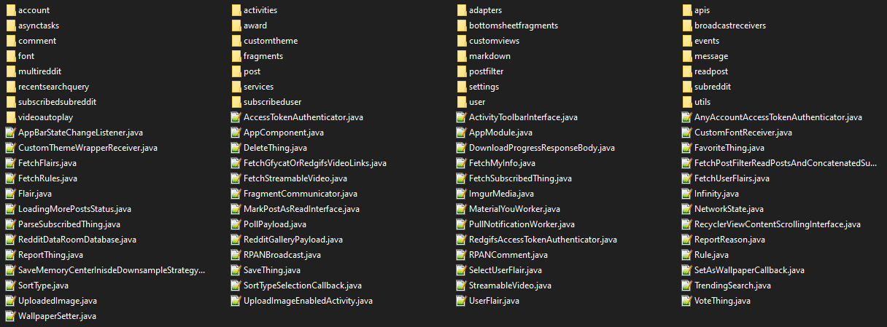
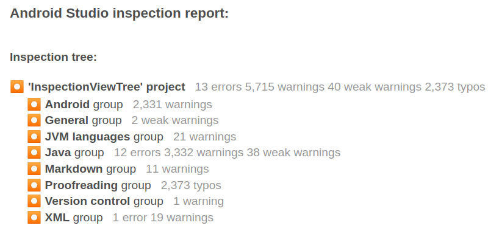

# Infinity for Reddit Codebase Analysis

## Source Code Organization

An important part of large software projects is how source code is created and organized throughout the project. A complex application such as *Infinity for Reddit* can easily have hundreds, if not thousands, of individual source code files. If these files are poorly organized it can quickly impair a developers ability to navigate a project. The becomes increasingly critical in open source projects, where many developers will be working on different components with little communication between eachother. Active open source projects also usually have many new contributors coming to the project who need to familiarize themself with the codebase. If not diligently enforced, code organization can spiral out of control and make it difficult for new and existing developers to interact with the codebase.

*Infinity for Reddit* makes an attempt at organizing its code. All Java source files for the application are found in the package `ml.docilealligator.infinityforreddit`. In this base package, there are about 51 different files in here, each pretaining to a different purpose. Files such as `Infinity.java` are high level instances with manager the initalization and general operation of the application. Other classes found in this package such as `ReportThing.java` pretain to very specific functions of the app. Additionally, this base package contains another 30 subpackages. These subpackages contain 2 - 30 child files, and usually pretain to a certain function or pattern type. Subpackages, even the larger ones, rarely have any further internal organization. One package may serve a number of different functions.

Figure 1 - Loosely organized source files in the root directory

### TODO: Complete

## Static Code Analysis

Static code analysis is the process of inspecting source code to find possible defects. Many clean code bases enforce a strict static code analysis process. By statically analyzing source code, the introduction of poor practices such as security flaws, formatting issues, and code smells can be avoided. Ideally, issues such as these are identified and fixed before merging into master. Unfortunately, Infinity for Reddit does not strictly adhere to these practices, leading to an untidy codebase.

Figure 2: Android Studio inspection report. This static code analysis discovered 13 errors, 5,715 warnings, and 2,373 potential typos.

An easy method to inspect the current state of a project is to run code analysis on the entire project using Android Studio. Figure 1, above, shows the results of this analysis on Infinity for Reddit. A significant number of errors and warnings were discovered. It should be noted, not all the discovered issues necessarily need to be resolved. For example, a warning is being generated due to an unused no-argument constructor, but it is common practice to always expose a constructor with no arguments.

There are varying levels of importance when analyzing the issues discovered. The high priority issues are critical to application security, longevity, and performance. Issues found pertaining to this include nullability issues, using deprecated code from third party dependencies, and compiler warnings.

Lower priority issues often do not impact the end-user, but are still important for maintaining a sustainable code repository. Examples of these issues include linting issues, unused imports, if statements with identical branches, and commented out code. Many of these issues can be quickly resolved manually, or even automatically by an IDE.

Whenever someone contributes code to Infinity for Reddit, the changes are analyzed by CodeQL as a part of the GitHub Actions pipeline. The pipeline fails if any new issues are introduced to the codebase. Recently, a pull request (PR) was opened that attempted to improve wiki link handling. Within the PR, a regular expression used to detect wiki links was modified. This modified expression successfully matched the appropriate cases, but in instances where a dash was repeated many times, the regular expression could grind to a halt due to recursive backtracking. The pipeline automatically reported this issue and allowed the issue to be resolved [[1](#references)].

Over time, the technical debt introduced to the codebase by not enforcing merge standards adds up. Ideally, a set of well-documented standards would be present in the repository and enforced when considering all changes. If a PR contains changes that go against the standard, the modifications would not be accepted until these issues are either resolved or deemed acceptable. Additionally, taking time to perform rework and reduce the statically identified issues will help ensure a healthier codebase.

# References
[1] [Improve wiki link handling (#1184)](https://github.com/Docile-Alligator/Infinity-For-Reddit/pull/1184)

[2] [Fix reply markdown (#974)](https://github.com/Docile-Alligator/Infinity-For-Reddit/actions/runs/3095391479/jobs/5009749979)